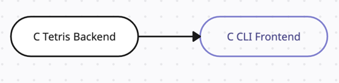
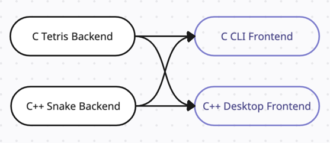
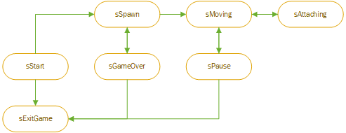
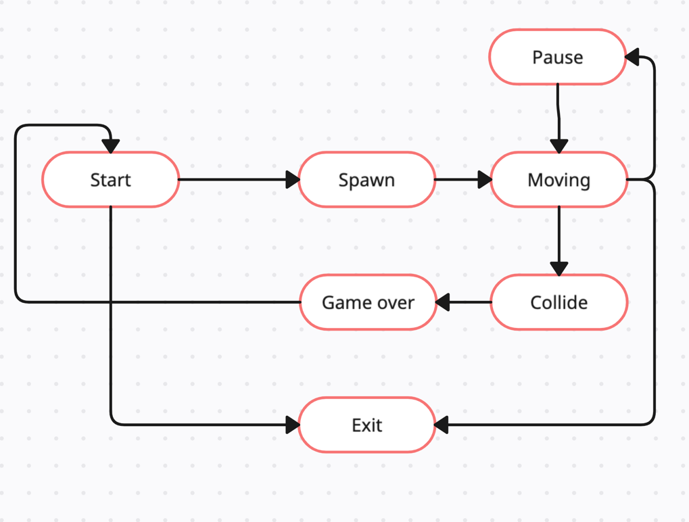

# BrickGame v2.0 aka Tetris + Snake Xerzia

BrickGame v2.0 is a continuing of [BrickGame v1.0]
## BrickGame v1.0 backend-frontend connection

In that version we maintain only one module of backend and frontend written on C language

## BrickGame v2.0 backend-frontend connection

In that version we maintain two modules of backend and frontend written on C and C++ languages

## Features

- Classic Tetris gameplay with the following mechanics:
    - Rotation of tetrominoes
    - Horizontal movement of tetrominoes
    - Accelerated tetromino falling (by holding the down arrow key)
    - Display of the next tetromino
    - Line clearing
    - Game over when the tetromino reaches the top of the game field
- Classic Snake gameplay with the following mechanics:
    - Snake should move through board automatically
    - Snake should be able to eat fruit placed on the board
    - The game is over if snake's length exceed 200 segments
    - The snake is dying when colliding with itself
    - The snake is dying when colliding with walls
    - The user should be able to change snake's direction
    - The user can speed up snake using special key
- Support for all physical buttons on the console:
    - Start game - Enter
    - Pause - P
    - End game - Esc
    - Up arrow - Change direction to the up
    - Down arrow - Change direction to the down
    - Left arrow - Change direction to the left
    - Right arrow - Change direction to the right
- Matrix-based game field with dimensions corresponding to the console's size (10x20 pixels)
- Proper stopping of tetrominoes after reaching the bottom or colliding with another tetromino
- Unit tests for the game logic library, achieving at least 90% code coverage

## Additional Mechanics

### Score Calculation Tetris

- 1 line cleared: 100 points
- 2 lines cleared: 300 points
- 3 lines cleared: 700 points
- 4 lines cleared: 1500 points

### Score Calculation Snake

- 1 fruit: 1 score

### High Score Tracking

- Display of the player's current score and highest score achieved
- Highest score is stored in a file or embedded database and persists between game sessions

### Level Progression Tetris

- Progression of levels every 600 points
- Increasing level increases the speed of tetromino falling

### Level Progression Snake

- Progression of levels every 5 score
- Increasing level increases the speed of the snakw

## Installation

1. Clone the repository.
2. Navigate to the `src/` directory.
3. Run `make install` to install the project.
4. Run `make run_cli` to start playing in cli.
5. Run `make run_desktop` to start playing in desktop.

## Usage Tetris

- Use the arrow keys to move and rotate tetrominoes.
- Press the down arrow key to make tetrominoes fall faster.
- Press the up arrow key to rotate tetrominoes.

## Usage Snake

- Use the arrow keys to change snake direction.
- Press the action key to speed up snake.

## Finite State Machine (FSM) Diagram Tetris

## Finite State Machine (FSM) Diagram Snake

